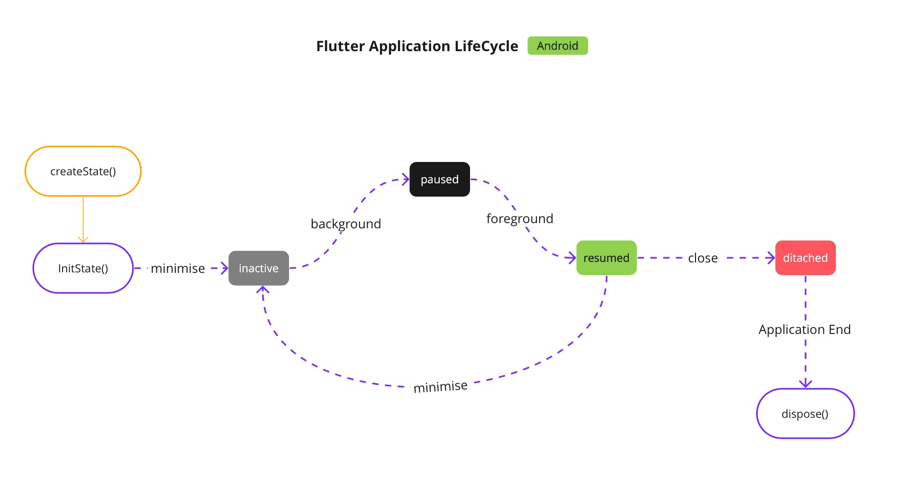

# flutter_app_lifecycle

A simple Flutter application that describe the lifecycle of flutter app.

### Application LifeCycle

Some time we have to run background/foreground services like location service in our app. Then you should know, how to handle Flutter Application LifeCycle. For LifeCycle, you need to implement the abstract class WidgetsBindingObserver it works when the app goes on foreground and background.

### WidgetsBindingObserver

WidgetsBindingObserver should be used to get default behaviors for all of the handlers. In our case, when we want to listen to the AppLifecycleState and call stop/start on our services.

So, We need to add WidgetsBindingObserver to our Stateful Widget. Some Stateful Widget methods we use here are:

- When the Framework is instructed to build a StatefulWidget, it immediately calls `createState()`
- `initState()`: This is the first method called when the widget is created (after the class constructor, of course.) initState is called once and only once. It must call `super.initState()`.
- `dispose()`:iscalledwhentheStateobjectisremoved, which is permanent. This method is where you should unsubscribe and cancel all animations, streams, etc

### AppLifecycleState

Simply The States that an application can be in

- **inactive**: The application is in an inactive state and is not receiving user input.
- **paused**: The application is not currently visible to the user, not responding to user input, and running in the background.
- **resumed**: The application is visible and responding to user input.
- **detached**: The application is still hosted on a flutter engine but is detached from any host views. (Android 10 & above only)

# Android
{:class="img-responsive"}
{:height="50%" width="50%"}
{:height="700px" width="400px"}
# iOS
